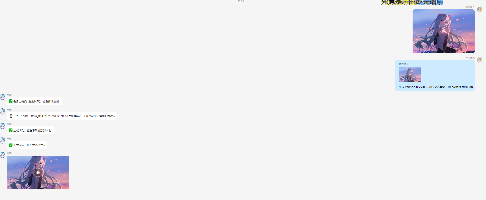
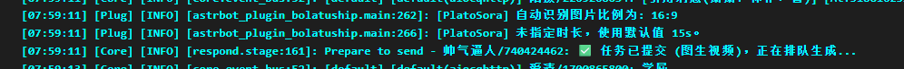

# AstrBot 柏拉图 Sora 视频生成插件
插件可以自动识别图片尺寸，默认时间15s。

本插件允许您的 AstrBot 接入**柏拉图 (Plato) API**，使用强大的 **Sora 2 系列模型**，提供高质量的 **文生视频** 和 **图生视频** 功能。（功能统一图生视频，检测到图片就是图生视频、没检测到就是文生视频）

它内置了完善的 API Key 轮询、用户/群组次数限制、每日签到、指令预设、黑白名单权限控制和代理支持，非常适合在聊天群中部署和管理。

**请仔细阅读安装说明的第 3 和第 4 步，这对于插件正常运行至关重要。**

## ✨ 功能特性

- **核心功能**:
  - **文生视频**: 根据文本提示词生成视频，默认生成 **15 秒**。
  - **图生视频**: 结合图片和文本提示词生成动态视频。
  - **自动识别比例**: 进行图生视频时，能自动识别原图是横屏、竖屏还是方屏，并生成对应比例的视频。
  - **高级参数**: 支持在提示词中通过括号传入 `(高清, 10s, 竖屏)` 等参数，自定义生成效果。
- **管理与限制**:
  - **指令预设**: 管理员可以轻松添加、删除、查看自定义的快捷指令，方便群员使用。
  - **每日签到**: 用户可通过 `#视频签到` 获取免费使用次数。
  - **多 Key 轮询**: 支持配置多个 API Key，并自动轮询使用，避免单个 Key 额度耗尽。
  - **次数限制**: 完善的**用户个人次数**和**群组共享次数**限制系统。
  - **次数管理**: 管理员可随时为用户或群组增加次数。
- **权限控制**:
  - 支持用户黑名单、用户白名单、群组白名单，实现精细化权限管理。
- **网络支持**:
  - 支持通过 HTTP/HTTPS 网络代理访问 API。

## 📦 安装说明

1.  **下载插件文件**:
    确保您拥有 `main.py` 和 `_conf_schema.json` 这两个文件。

2.  **放置文件**:
    在您的 AstrBot 根目录下，找到 `data/plugins` 文件夹。在其中创建一个新的文件夹，命名为 `astrbot_plugin_plato_sora`。
    将 `main.py` 和 `_conf_schema.json` 这两个文件放入刚刚创建的文件夹中。
    最终的目录结构应如下所示：
    ```
    AstrBot/
    └── data/
        └── plugins/
            └── astrbot_plugin_plato_sora/
                ├── main.py
                └── _conf_schema.json
    ```

3.  **安装依赖库 (重要)**:
    为了支持**自动识别图片比例**功能，插件需要 `Pillow` 库。请在您的机器人运行环境中执行以下命令进行安装：
    ```bash
    pip install Pillow
    ```

4.  **配置 AstrBot (重要)**:
    此步骤对于机器人**发送本地视频文件**至关重要。
    打开 AstrBot 的系统配置文件 (`data/configs/global_config.json` 或在 WebUI 的系统设置中)，找到 **“对外可达的回调接口地址”** 这一项，并根据您的部署方式填入正确的地址：
    - **Docker 用户**: 重启容器后在控制台日志中找到类似 `ws://172.16.x.x:6199/ws` 的地址，将其中的 `ws` 协议和端口 `6199` 修改为 `http` 和 `6185`。例如，填入 `http://172.16.x.x:6185`。
    - **手动部署或 Docker Host模式**: 可以直接填入 `http://127.0.0.1:6185`。

5.  **重启 AstrBot**:
    完全关闭并重新启动您的 AstrBot 程序，插件将自动加载。

## ⚙️ 配置说明

插件首次加载后，会在 `data/configs` 目录下生成一个名为 `astrbot_plugin_plato_sora.json` 的配置文件。请打开并编辑它。

以下是所有配置项的详细说明：

| 配置项 (Key) | 类型 | 描述 | 默认值 |
| :--- | :--- | :--- | :--- |
| `api_url` | string | 柏拉图 API 的 URL 地址。 | `"https://api.bltcy.ai"` |
| `api_keys` | list | **【必需】** 您的 API 密钥列表。可以填写多个，会自动轮换。 | `[]` |
| `default_model` | string | 默认使用的视频生成模型。 | `"sora-2-fast"` |
| `prefix` | bool | 指令是否必须带 `#` 或 `@机器人` 前缀。 | `true` |
| `extra_prefix`| string | 自定义提示词的指令前缀。 | `"生成视频"` |
| `use_proxy` | bool | 是否启用网络代理。 | `false` |
| `proxy_url` | string | 网络代理地址。 | `""` |
| `user_whitelist`| list | 【权限】用户白名单。 | `[]` |
| `user_blacklist`| list | 【权限】用户黑名单。 | `[]` |
| `group_whitelist`| list | 【权限】群聊白名单。 | `[]` |
| `enable_user_limit`| bool | 是否启用【用户】个人次数限制。 | `true` |
| `enable_group_limit`| bool | 是否启用【群组】共享次数限制。 | `false` |
| `enable_checkin` | bool | 是否开启每日签到功能。 | `true` |
| `checkin_fixed_reward`| int | 签到固定奖励的次数。 | `3` |
| `enable_random_checkin`| bool| 是否开启随机签到奖励。 | `false` |
| `checkin_random_reward_max`| int| 随机签到奖励的最大值。 | `5` |
| `polling_interval`| int | 【高级】任务状态轮询间隔（秒）。 | `5` |
| `polling_timeout` | int | 【高级】任务超时时间（秒）。 | `300` |
| `prompt_list` | list | 【核心】指令预设列表，格式: `"触发词:提示词"`。 | `[]` |

**重要提示**: 权限逻辑为：黑名单最优先。如果设置了白名单，则用户/群组必须在白名单内才可使用。

## 🚀 使用指令

### 普通用户指令

-   **生成视频**: `#生成视频 <提示词> [附带图片]`
    -   **文生视频**: `#生成视频 一只猫在弹钢琴` (默认生成15秒视频)
    -   **图生视频**: 发送一张图片，然后回复该图片并输入 `#生成视频` (插件会自动识别图片比例)
    -   **高级用法**: `#生成视频 一只猫在弹钢琴 (竖屏, 10s, 高清)`

-   **使用预设**: `#<预设触发词>` (例如: `#电影感`)
    -   管理员可通过指令添加多种预设，方便快速调用。

-   **每日福利**: `#视频签到`
    -   每天可使用一次，获取免费次数。

-   **查询次数**: `#视频查询次数`
    -   查询您个人和所在群聊的剩余使用次数。

-   **获取帮助**: `#视频帮助`
    -   查看本插件的帮助信息和所有指令。

### 管理员指令

**注意**: 需要将您的 QQ 号配置在 AstrBot 的全局配置文件 `global_config.json` 的 `admins_id` 列表中。

-   **增加用户次数**: `#视频增加用户次数 <QQ号> <次数>`
    -   示例: `#视频增加用户次数 123456 20`

-   **增加群组次数**: `#视频增加群组次数 <群号> <次数>`
    -   示例: `#视频增加群组次数 111111 100`

-   **添加/修改预设**: `#视频添加预设 <触发词>:<提示词>`
    -   示例: `#视频添加预设 电影感:cinematic, epic, 4k`

-   **删除预设**: `#视频删除预设 <触发词>`
    -   示例: `#视频删除预设 电影感`

-   **查看预设**: `#视频预设列表`

-   **清理缓存**: `#视频清除缓存`
    -   删除插件下载的所有临时视频文件。
## 🎨 效果展示

*以下图片均为插件实际生成效果。*

| `视频生成效果` | `输出日志` |
| :---: | :---: |
|  |  |

## ❓ 常见问题 (FAQ)

1.  **机器人提示 "未配置任何 API 密钥"**
    > 请检查配置文件 `astrbot_plugin_plato_sora.json`，确保 `api_keys` 字段已正确填写您的密钥。

2.  **视频发送失败，或提示“文件消息缺少参数”、“识别URL失败”**
    > 这大概率是因为您没有正确配置 **“对外可达的回调接口地址”**。请严格按照上方 **【安装说明】的第 4 步** 进行检查和配置。这是确保机器人能正确找到并发送本地文件的关键。

3.  **提示 "次数已用尽"**
    > 这说明您的个人次数或所在群组的共享次数已经用完。您可以通过 `#视频签到` 获取免费次数，或联系机器人管理员为您增加次数。

4.  **机器人没有反应**
    > -   请检查 AstrBot 的后台日志，确认是否有报错信息。
    > -   检查您的指令是否符合格式，例如是否以 `#` 开头。
    > -   如果您设置了白名单，请确认您的 QQ 号或所在群号是否在白名单内。
    > -   确认您没有在黑名单内。

5.  **次数为0还能使用**
    > -   请检查您是否是管理员。管理员不受次数限制。
    > -   请检查插件配置，`enable_user_limit` (用户限制) 和 `enable_group_limit` (群组限制) 是否都已开启 (`true`)。
